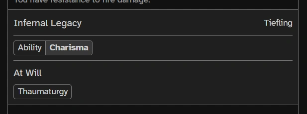

# Overview

When you launch Tavern on a large screen, you'll see something like this:


There are three major sections of the app, each of which will be described in more detail below:

- The [Info Panel](#info-panel) is the section on the left side of the screen, which contains game master (GM) controls, character cards, and settings.

- The [Communication Panel](#communication-panel) is the section on the right side of the screen, which contains the character selector, the timeline of chat entries and dice rolls, and entry fields for both chat and dice rolls.

- The rest of the screen, between the two panels, is the [Map](#map-1).

> **Note:** On smaller screens, one or both of the panels may be hidden by default. You can toggle the visibility of the panels using the <span class="icon">info</span> or <span class="icon">comment</span> buttons at the bottom of the panel, or by using the <kbd>[</kbd> or <kbd>]</kbd> keyboard shortcuts.

# Info Panel

The Info Panel consists of three different sections:

- [GM Controls](#gm-controls)
- [Character Cards](#character-cards)
- [Settings](#settings)

## GM Controls

The **GM** checkbox allows you to toggle GM mode on and off.

In GM mode, you can add supporting characters (e.g., NPCs or monsters), rearrange the character cards (to track initiative order), and add and remove tokens from the map.

GM mode also affects which character cards you can see and how much information you can see onthem, as described below.

When you press the **Add Supporting** button, you will be presented with the following dialog:


The search box will do a fuzzy search for matching entries, so it should find what you're looking for even with a typo or two.

Once you start typing, one of the entries in the list will be selected, and you can click/tap or use the <kbd>↑</kbd> and <kbd>↓</kbd> keys to select a different entry.

The **Randomize Name** checkbox will add a colorful descriptor to the name of the added character, which can be helpful to distinguish between multiple characters of the same kind. Of course, if you don't like the descriptor, you can always just change the name in the character sheet afterwards.

The **Quantity** selector allows you to add multiple characters at once in case the party runs across a group of friends (or foes).

## Character Cards

Character cards are the main way to get to any character-specific information. A typical character card looks something like this:


On desktop computers, (while in [GM mode](#gm-controls)), you can drag the character's avatar (at the top left) onto the map to create a token. (If you're on a mobile device, a GM can still create tokens by long-pressing an empty square on the map.) Only a GM can see supporting characters that don't have a token on the map.

The hit point (HP) bar shows at a glance how many HP a character has remaining. Only a GM can see the HP bars for supporting characters.

Since characters can have temporary hit points, it is possible for the total hit point bar (green normal HP + blue temporary HP) to extend past the end of the outline indicating the character's maximum HP.

While it is possible to set a character's HP on their character sheet, there is also a quick edit field available by clicking/tapping on the underlined **HP** text:


As with the character sheet, you can either enter a new HP value directly or use relative values such as `+3` or `-5`. If you enter a negative relative value, temporary HP will be removed before modifying normal HP.

For lead characters (i.e., PCs), if a character has a token, they will also have a <span class="icon">location_searching</span> button. Clicking/tapping on this button will center the map on their token and highlight it. Supporting characters with tokens can be located by clicking/tapping on their avatar.

Supporting characters have an <span class="icon">archive</span> button, which will move the character from the sorted list of character cards into a dedicated **Archived Characters** section at the bottom of the info panel (removing their token if one exists). Archived characters can be unarchived at any time by clicking/tapping the <span class="icon">unarchive</span> button.

The remaining buttons, such as <span class="icon">newsmode</span> or <span class="icon">backpack</span> will open corresponding sections of the character sheet. You can hover over them (on desktop) or long-press them (on mobile) to see which section they correspond to.

Finally, supporting characters each get a numeric keyboard shortcut, which allows you to focus their character card and either locate their token (by pressing the number again) or jump to one of the sheets of their character page. When you press the number, their card will change to help indicate the new keyboard shortcut options:


_Back to [Info Panel](#info-panel)_ &mdash; _Jump to [Top](#overview)_

## Settings

Clicking the **Settings** text at the bottom of the info panel will expose a list of app settings, described below:

### Map

- **Snap To Grid** &mdash; When this setting is enabled, when a dragged token is dropped, it will snap to the center of the nearest grid cell. Whether this setting is enabled or not, you can get the opposite behavior by holding <kbd>Alt</kbd> or <kbd>Option</kbd> key while dropping the token.

- **Diagonal Mode** &mdash; This setting changes how the measure tool counts diagonal distance. In **1-1-1-1** mode, every diagonal is treated the same as orthogonal movement. In **1-2-1-2** mode, every second instance of diagonal movement takes twice as much movement.

- **Allow Cutting Corners** &mdash; This setting allows tokens to cut corners, which means that they can move diagonally even if there is a corner in one of the orthogonal squares in the direction of that diagonal direction.

### Lighting

- **Lighting Quality**

  - **Good** &mdash; In this mode, lights only cast hard shadows.
  - **Better** &mdash; In this mode, lights cast soft shadows (i.e., shadows farther from the object casting the shadow have softer edges).
  - **Best** &mdash; In this mode, not only do lights cast soft shadows, but light bounces off of walls and around corners. This will cause more CPU usage when moving lights (but not while moving the map), and requires an additional download of lighting data, which is approximately 10MB for the tech demo.

- **Update On Drop** &mdash; When this setting is enabled, a token's light is only updated when the token is dropped (rather than as it moves), which will significantly reduce CPU usage while dragging tokens.

### Renderer

- **Tone Mapping Mode** &mdash; This is just a debugging feature that will let you see a colormap version of the scene luminance (how much light is being produced) instead of the actual light color.

_Back to [Info Panel](#info-panel)_ &mdash; _Jump to [Top](#overview)_

# Communication Panel

There are four major components of the communication panel:

- [Active Character](#active-character)
- [Timeline](#timeline)
- [Chat](#chat)
- [Dice Rolls](#dice-rolls)

## Active Character

In a given browser session, there can only be one active character at a time. The active character, indicated by a highlighted name in their character card, will be used when entering chat messages and rolls, and a character must be active in order to edit their character sheet or to perform rolls from their character sheet.

## Timeline

The timeline shows all chat messages and rolls performed with the newest messages at the bottom. Messages from a given player will be grouped together.

For attack rolls that result in damage, the roll entry in the timeline may have a button to roll the damage right away, as long as the relevant character is active:


## Chat

The chat functionality is relatively minimal right now, but you can send a chat message for the active character by clicking/tapping on the chat entry at the bottom of the communication panel or by pressing <kbd>T</kbd>.

## Dice Rolls

Unlike some other virtual tabletops, dice rolls in Tavern are entered into their own field. This lets the roll entry field do some helpful things. To start, either click/tap the roll entry field or press <kbd>R</kbd>:


As the dialog indicates, there are a couple of different ways to enter a roll.

One is to type the name of an existing roll:


As with supporting character selection, the name matching is fuzzy, and as you type, one of the entries will be highlighted, allowing you to select other options with the <kbd>↑</kbd> and <kbd>↓</kbd> keys.

For named rolls, there are often additional options, such as adding advantage or a proficiency bonus. If you select one of these rolls, you will be presented with an options dialog like this:


This particular dialog indicates that the <kbd>A</kbd>, <kbd>D</kbd>, and <kbd>P</kbd> keyboard shortcuts can be used to toggle their respective options to smooth the flow from typing a roll name, to modifying the roll, to actually performing the roll.

Named rolls also provide an **Additional Modifier** field that can be used to modify the final result.

You may also see this roll options dialog when clicking a roll button in a character sheet or at the end of another roll in the timeline. If you know that you are going to want the default options for the roll, holding <kbd>Shift</kbd> while clicking the button will skip the options dialog and roll immediately.

The other way is to enter a manual roll. When you enter a manual roll, you can use a few different features. The most basic roll is to enter \[number of dice\]d\[dice sides\], such as `1d20` for a single 20-sided die. On top of this, Tavern provides some modifiers like adding `kh2` to the end of a roll to keep the two highest rolls.

> **Note**: Tavern does not have nearly as many roll modifiers as some other VTTs. This is a known issue and more will be added in the future as game system support is expanded. Feel free to ask on [Discord](https://discord.gg/SkjzZVKe2m) if there is a particular modifier you'd like to see.

On top of roll modifiers, Tavern also has robust support for variables that can be inserted into roll expressions by typing a `$`:


As with the named roll text search, variable names will be searched using a fuzzy match and can be selected with the <kbd>↑</kbd> and <kbd>↓</kbd> keys.

_Back to [Communication Panel](#communication-panel)_ &mdash; _Jump to [Top](#overview)_

# Map


To move around the map, click/tap and drag. The map can be zoomed using the mouse wheel or by pinch zooming on touchscreens.

Currently there are two major things that can be done with the map:

- [Managing Tokens](#managing-tokens)
- [Measuring Distances](#measuring-distances)

In addition, [character sheets](#character-sheets) are displayed over the map when accessed from the character card or token's context menu.

## Managing Tokens

Tokens can only be created and deleted [by a GM](#gm-controls). Tokens have a context menu, accessible by right-clicking/long-pressing on the token, which allows quick access to the pages of the character sheet:


### Creating Tokens

If you're on a desktop computer, a GM can create a token by either dragging an avatar from a [character card](#character-cards) onto the map or right-clicking/long-pressing on an empty map square and adding a token from the menu:


### Deleting Tokens

Tokens can be deleted by a GM from the token's context menu. When a supporting character is archived, any token corresponding to them will automatically be deleted.

### Moving Tokens

On both desktop and mobile devices, tokens are moved by long-clicking or long-pressing the token and then dragging it. This is designed to make it easy to scroll the map around without unintentionally moving tokens around. However, if you would prefer to move a token right away, you can hold <kbd>Shift</kbd> and the token will be picked up right away.

By default, tokens snap to the grid when they're dropped, but you can change this behavior in [settings](#map) or override it temporarily by holding <kbd>Alt</kbd> or <kbd>Option</kbd> key while dropping the token.

## Measuring Distances

To measure distances on the map, you can select the measure tool using the <span class="icon">square_foot</span> button in the toolbar at the top right of the map or by pressing the <kbd>M</kbd> key. You can leave measure mode by clicking the **Cancel** button that appears at the bottom of the screen or by pressing <kbd>Esc</kbd>.

There are two different ways to measure: from a point or along a path. In either case, how Tavern will compute distances depends on your [map settings](#map).

### From a Point

To measure from a point, select an origin by hovering over it (on desktop) or tapping it (on mobile). The map will show the distance to every square on the map along with a color code indicating how far away it is:


### Along a Path

To measure along a path, select an origin by clicking it (on desktop) or long-pressing it (on mobile). You can then select another point by hovering or tapping it (like selecting an origin for **From a Point**). The map will then show the shortest path to that new destination.

You can also set waypoints along the path by clicking or long-pressing (like starting a path). Waypoints can be deleted by hovering/tapping the associated <span class="icon">timeline</span> icon and clicking/tapping **Delete**. The most recently created waypoint can also be deleted by pressing <kbd>Del</kbd>.

_Back to [Map](#map-1)_ &mdash; _Jump to [Top](#overview)_

## Character Sheets

Since the SRD 5.1 system integration is still under development, this will not provide an exhaustive tutorial on how to use the various character sheet pages, but rather some tips that may not be obvious from using the app itself.

> One of the primary goals of this project is that basic functionality is intuitive, and to that end, most items on the character sheet have tooltips to help show what they do. If you find a case where there isn't a tooltip and the function is still unclear, please feel free to report it on [Discord](https://discord.gg/SkjzZVKe2m).

- [Activation](#activation)
- [Automatic Updates](#automatic-updates)
- [Chips](#chips)
- [Custom Inputs](#custom-inputs)
- [Description Rolls](#description-rolls)
- [Equipment](#equipment)
- [Markdown Editing](#markdown-editing)
- [Numeric Fields](#numeric-fields)
- [Resources](#resources)

### Activation

In order to edit a character sheet or perform rolls from it, the relevant character must be activated. The only exception to this is supporting characters (e.g., NPCs or monsters), which don't need to be activated, but must be rolled by a GM (since only a GM can see a supporting character's sheet).

### Automatic Updates

Some rolls, like death saving throws or maximum HP for supporting characters, will automatically update the relevant sections of the character sheet after the roll completes.

### Chips



Many list items are presented as "chips", small boxes around text, such as the Charisma ability or the Thaumaturgy spell shown above. These chips often have tooltips for more information, and are sometimes clickable/tappable for even more detail. For example, clicking/tapping on the Thaumaturgy chip shown above presents the following dialog:


### Custom Inputs

When editing fields like conditions and languages that have a pre-existing list of options, you can enter custom entries in the field at the top of the dialog:


### Description Rolls

Some descriptions, such as those for some spells, can have roll buttons embedded in them, like this one for *sacred flame*:


Clicking/tapping any of the `Xd8` buttons will automatically present roll options for a radiant damage roll. If the default options are acceptable, holding <kbd>Shift</kbd> while clicking/tapping will perform the roll immediately.

<a name="table-rolls" />
Tavern also supports table rolls, like this one found in the *acolyte* background:


Clicking/tapping the `1d6` button will immediately perform the roll and show the matching table entry:


### Equipment

Some equipment, such as armor and weapons, must be activated to see their effects by clicking the checkbox at the beginning of the row. The game system implementation will keep track of armor and one-handed/two-handed/versatile weapons automatically as shown at the top of the **Inventory** page.

Once a weapon is activated, attack rolls for that weapons are automatically prepared and can be accessed either from the attacks section of the **Abilities** page or from the [roll entry](#dice-rolls) section of the communication panel, such as by pressing <kbd>R</kbd> and typing the first few letters of the weapon name.

On desktop computers, items can be moved between the **Carried Equipment** table and a backpack by dragging and dropping them.

Items that are dropped from the inventory currently disappear and will need to be re-added from the **Add Item** dialog.

> **Note**: Drag-and-drop on mobile devices and more robust drop/pick up support are planned for future versions of Tavern.

### Markdown Editing

Long-form text fields, such as those on the **Biography** page, support [Markdown](https://commonmark.org/help/) formatting. They will show some Markdown formatting while editing (after hitting <span class="icon">edit</span>), and will only show the formatted result when editing is complete (after hitting <span class="icon">check</span>).

You can make your own [table rolls](#table-rolls) using [table syntax](https://www.markdownguide.org/extended-syntax/#tables) like the following (the thing that makes it work is the link to `#table-roll`):

```markdown
| [1d2](#table-roll) | Result |
| :----------------: | :----: |
| 1                  | Heads  |
| 2                  | Tails  |
```

### Numeric Fields

All editable numeric fields on the character sheet support both absolute and relative numbers, which means that you can, for example, either set a character's experience to `1500` directly or add 300 experience to the current value by entering `+300`.

In the case of hit points, entering a negative number of normal HP will deduct from temporary HP first, if the character has any.

### Resources

Characters can have resources or features that have a limited number of uses. These uses can be tracked using the checkboxes inside the resource description. Sometimes exhausting all uses of a feature can prevent additional rolls until more uses are gained:


_Back to [Map](#map-1)_ &mdash; _Jump to [Top](#overview)_